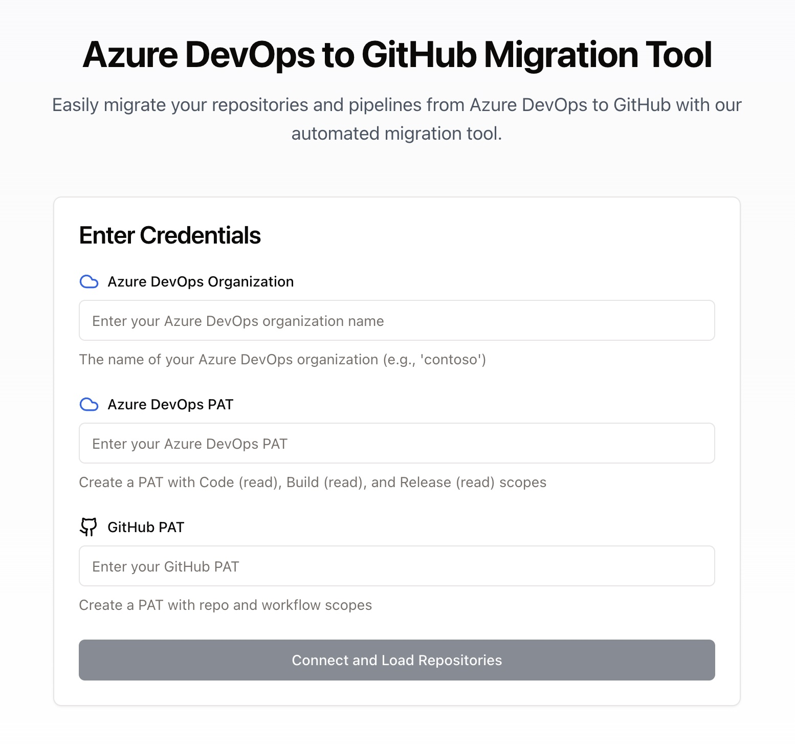

# Azure DevOps to GitHub Migration Tool

A web-based application that facilitates the migration of repositories and pipelines from Azure DevOps to GitHub.

## Screenshot



## Features

- Migrate repositories from Azure DevOps to GitHub
- Convert Azure Pipelines to GitHub Actions
- Support for both personal and organization GitHub accounts
- Progress tracking for migrations
- Secure token handling with encryption

## Prerequisites

- Node.js 18+
- npm or yarn
- Azure DevOps Personal Access Token with Code (read), Build (read), and Release (read) scopes
- GitHub Personal Access Token with repo and workflow scopes

### Local Development Setup

**Requirements:**
- Node.js 18+
- npm or yarn
- Git
- Code editor
- Generate encryption key and session secret

# Generate encryption key
openssl rand -base64 32

# Generate session secret
openssl rand -base64 32

**Steps:**
1. Clone repository:
```bash
git clone <repository-url>
cd Azure-Devops-to-Github-Migration-Tool
```

2. Install dependencies:
```bash
npm install
```

3. Create `.env` file:
```
PORT=5000
ENCRYPTION_KEY=<your-secure-key>
SESSION_SECRET=<your-session-secret>
```

4. Start development server:
```bash
npm run dev
```

5. Access application at `http://0.0.0.0:5000`


## Project Structure

```
├── client/               # Frontend React application
│   ├── src/
│   │   ├── components/   # UI components
│   │   ├── hooks/       # Custom React hooks
│   │   ├── lib/         # Utility functions and API clients
│   │   └── pages/       # Page components
├── server/              # Backend Express server
│   ├── utils/          # Server utilities
│   ├── routes.ts       # API route definitions
│   └── index.ts        # Server entry point
└── shared/             # Shared TypeScript types and schemas
```

## Authentication

The application uses Personal Access Tokens (PATs) for both Azure DevOps and GitHub authentication:

### Azure DevOps PAT Requirements
- Organization scope (read)
- Code scope (read)
- Build scope (read)
- Release scope (read)

### GitHub PAT Requirements
- repo scope (full)
- workflow scope

## API Endpoints

### Azure DevOps
- `POST /api/auth/azure/validate` - Validate Azure PAT
- `GET /api/azure/repositories` - List Azure repositories

### GitHub
- `POST /api/auth/github/validate` - Validate GitHub PAT
- `GET /api/github/organizations` - List GitHub organizations
- `GET /api/github/user` - Get GitHub user info

### Migrations
- `POST /api/migrations` - Start a new migration
- `GET /api/migrations` - List all migrations
- `GET /api/migrations/:id` - Get migration status


## Security Considerations

- All tokens are encrypted before storage
- Session tokens expire after 8 hours
- HTTPS-only communication
- Cross-Origin Resource Sharing (CORS) protection

## Contributing

To contribute to this project:

1. Fork the repo
2. Create your feature branch
3. Commit your changes
4. Create a new Pull Request

## License

This project is MIT licensed.
